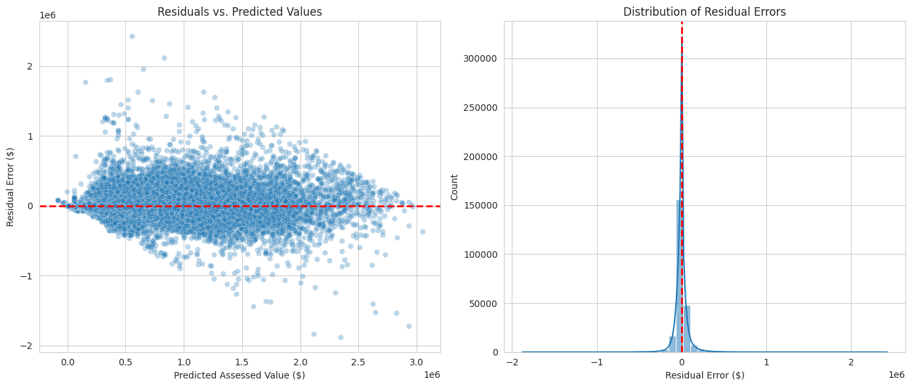

# Calgary Real Estate Valuation Engine

**A residential Automated Valuation Model (AVM) achieving 94.3% R² on unseen data.**


---

## 📊 Executive Summary

This project implements an end-to-end machine learning pipeline to predict **residential property values in Calgary, Alberta** using open municipal data.

Moving beyond simple coordinates, the model uses a **Hybrid Spatial–Categorical strategy** to capture the nuance of urban pricing. By engineering features around property utility and neighborhood clusters, it achieves high predictive performance with minimal overfitting.

### Key Performance Indicators (Held-out Test Set)

| Metric | Score | Context |
| :--- | :--- | :--- |
| **R² Score** | **0.943** | Explains 94.3% of variance in assessed values. |
| **MAE** | **$41,951** | Average absolute error in dollar terms. |
| **RMSE** | **$80,392** | Penalizes larger errors more heavily. |
| **Train–Test Gap** | **0.010** | Difference between Train and Test R² (Low overfitting). |

---

## 🧠 Engineering Strategy: "Context over Coordinates"

Early baselines using only raw Latitude/Longitude features plateaued around **0.84 R²**. The jump to **0.94 R²** came from treating **context** as a first-class signal:

1.  **Granular Zoning (`SUB_PROPERTY_USE`)**
    Distinguishes between property types (e.g., "Low-rise Condo" vs. "Detached Home") rather than treating all residential lots as homogeneous.
2.  **Neighborhood Codes (`COMM_CODE`)**
    Leverages XGBoost's native categorical support (`enable_categorical=True`) to handle high-cardinality identifiers efficiently without memory-heavy encoding.
3.  **Precise Geometry**
    Parses WKT `MULTIPOLYGON` data via **Shapely** to extract exact geometric centroids (longitude/latitude) for each parcel.

---

## 🗂️ Data Pipeline

* **Source:** City of Calgary Open Data
* **Volume:** **~2.2 Million records** (covering assessment years 2020–2024).
* **Dataset:** "Total Property Assessed Value"
* **Scope:** **General Residential Market** (Properties < $3M).
    * *Note: Ultra-luxury outliers (>$3M) were explicitly removed to improve model stability for the general housing stock.*

**Processing Highlights:**
* **Parsing:** Converted raw WKT polygon strings into coordinate floats.
* **Cleaning:** Standardized currency strings and handled missing data.
* **Filtering:** Isolated `ASSESSMENT_CLASS_DESCRIPTION == "Residential"`.

---

## 📉 Visual Diagnostics

### 1. Feature Importance
*Property Type and Neighborhood are the primary value drivers, matching appraisal logic.*


### 2. Actual vs. Predicted Values
*A tight cloud along the 45° line indicates strong predictive accuracy.*


### 3. Residual Analysis
*Errors are centered at zero. The "fan" shape reflects natural variance—larger dollar errors for expensive homes—rather than model bias.*


### 4. Correlation Matrix
*Core numeric inputs exhibit low correlation, which supports model stability.*


---

## ⚙️ Tech Stack

* **Language:** Python 3.10+
* **Modeling:** `xgboost` (GPU-accelerated), `scikit-learn`
* **Data:** `pandas`, `numpy`, `shapely` (Geospatial)
* **Visualization:** `seaborn`, `matplotlib`

---

## 🚀 How to Run

1.  **Clone the repo**
    ```bash
    git clone [https://github.com/mikebaloun/Predicting-Calgary-Real-Estate-Property-Value.git](https://github.com/mikebaloun/Predicting-Calgary-Real-Estate-Property-Value.git)
    cd Predicting-Calgary-Real-Estate-Property-Value
    ```

2.  **Install dependencies**
    ```bash
    pip install xgboost shapely pandas numpy seaborn matplotlib scikit-learn
    ```

3.  **Download the Data**
    * Download the **"Total Property Assessed Value"** CSV from the [Calgary Open Data](https://data.calgary.ca/).
    * Place it in a `data/` directory.

4.  **Run the Analysis**
    * Upload `Predicting_Calgary_Real_Estate_Property_Value.ipynb` to Google Colab.
    * Select a **T4 GPU** runtime for faster execution.
    * Run all cells.

---
*Author: Michael Baloun | Date: November 17, 2025*
